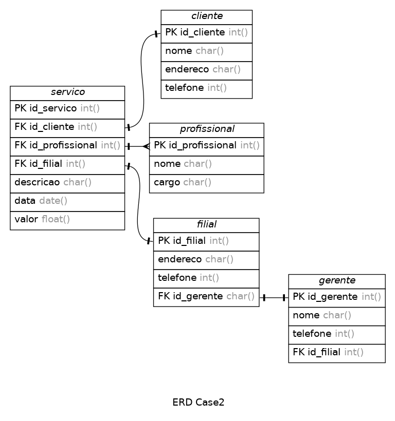

# Case 2
### MBA Engenharia de Dados
### Universidade Presbiteriana Mackenzie
### Matéria: Data Collection & Storage

## Proposta 
1. Pense no nome do Domínio de informação e da Sigla
2. Pense no modelo de negócio e crie os campos com nomes lógicos e físicos
3. Crie o Glossário de Dados
4. Desenhe as tabelas físicas e lógicas Relacionais com as (Chave PK e campos)
5. Crie as tabelas Fato e Dimensão
6. Crie o Script SQL para criar a tabela FATO (Extract / Data Collection)

## Solução

### 1. Pense no nome do Domínio de informação e da Sigla
### Domínio de informação: Prestação de Serviços
### Sigla: SRVC

### 2. Modelo de negócio e campos com nomes lógicos

## Tabelas

### servico

|Lógico                 |   Físico          |   Chave   |
|-----------------------|---------------    |:---------:|
|Código do Serviço      |`id_servico`       |PK         |
|Código do Profissional |`id_profissional`  |FK         |
|Filial executada       |`id_filial`        |FK         |
|Descrição do Serviço   |`descricao`        |           |
|Data do Serviço        |`data`             |           |
|Valor do serviço       |`valor`            |           |

### cliente

|Lógico                 |   Físico      |   Chave   |
|-----------------------|---------------|:---------:|
|Código do Cliente      |`id_cliente`   |PK         |
|Nome do Cliente        |`nome`         |           |
|Endereço do Cliente    |`endereco`     |           |
|Telefone do Cliente    |`telefone`     |           |

### profissional

|Lógico                 |       Físico      |   Chave   |
|-----------------------|---------------    |:---------:|
|Código do Profissional |`id_profissional`  |PK         |
|Nome do Profissional   |`nome`             |           |
|Cargo do Profissional  |`cargo`            |           |

### filial

|Lógico                     |       Físico      |   Chave   |
|---------------------------|-------------------|:---------:|
|Código da Filial           |`id_filial`        |PK         |
|Código do Gerente da Filial|`id_gerente`       |FK         |
|Endereço da Filial         |`endereco`         |           |
|Telefone da Filial         |`telefone`         |           |

### gerente

|Lógico                 |       Físico      |   Chave   |
|-----------------------|-------------------|:---------:|
|Código do Gerente      |`id_gerente`       |PK         |
|Nome do Gerente        |`nome`             |           |
|Telefone do Gerente    |`cargo`            |           |

### 3. Crie o Glossário de Dados

|       Campo                   |   Descrição                       |
|        --                     |       ---                         |
|servico.id_servico             |Identificador único do serviço     |
|servico.id_profissional        |Identificador único do profissional|
|servico.id_cliente             |Identificador único do cliente     |
|servico.id_filial              |Identificador único da filial      |
|servico.descricao              |Descrição do serviço prestado      |
|servico.data                   |Data do serviço prestado           |
|servico.valor                  |Valor do serviço prestado          |
|cliente.id_cliente             |Identificador único do cliente     |
|cliente.nome                   |Nome do cliente                    |
|cliente.endereco               |Endereço do cliente                |
|cliente.telefone               |Telefone do cliente                |
|profissional.id_profissional   |Identificador único do profissional|
|profissional.nome              |Nome do Profissional               |
|profissional.cargo             |Cargo do profissional              |
|filial.id_filial               |Identificador único da filial      |
|filial.endereco                |Endereço da filial                 |
|filial.telefone                |Telefone da filial                 |
|filial.id_gerente              |Identificador único do gerente     |
|gerente.id_gerente             |Identificador único do gerente     |
|gerente.nome                   |Nome do gerente                    |
|gerente.telefone               |Telefone do gerente                |

### 4. Desenhe as tabelas físicas e lógicas Relacionais com as (Chave PK e campos)

### Tabelas Físicas 

### servico
|Campo              |Tipo           |PK |NULL   |
|-                  |-              |-  |-      |
|id_servico         |int            |S  |N      |
|id_profissional    |int            |N  |N      |
|id_cliente         |int            |N  |N      |
|id_filial          |int            |N  |N      |
|descricao          |varchar(200)   |N  |N      |
|data               |datetime       |N  |N      |
|valor              |float          |N  |N      |

### cliente

|Campo              |Tipo           |PK |NULL   |
|-                  |-              |-  |-      |
|id_cliente         |int            |S  |N      |
|nome               |varchar(50)    |N  |N      |
|endereco           |varchar(100)   |N  |N      |
|telefone           |int            |N  |N      |

### profissional

|Campo              |Tipo           |PK |NULL   |
|-                  |-              |-  |-      |
|id_profissional    |int            |S  |N      |
|nome               |varchar(50)    |N  |N      |
|cargo              |varchar(30)    |N  |N      |

### filial

|Campo              |Tipo           |PK |NULL   |
|-                  |-              |-  |-      |
|id_filial          |int            |S  |N      |
|id_gerente         |int            |N  |N      |
|telefone           |int            |N  |N      |
|endereco           |varchar(100)   |N  |N      |

### gerente

|Campo              |Tipo           |PK |NULL   |
|-                  |-              |-  |-      |
|id_gerente         |int            |S  |N      |
|nome               |varchar(50)    |N  |N      |
|telefone           |int            |N  |N      |

### Tabelas Lógicas

